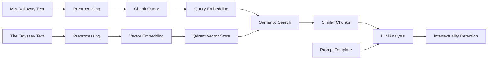

# Woolf Intertextuality Analysis

A pipeline for detecting and analyzing intertextual references between Virginia Woolf's "Mrs Dalloway" and Homer's "The Odyssey" using semantic search and large language models.

## Project Overview

This project implements a Retrieval Augmented Generation (RAG) pipeline to identify and analyze potential intertextual references between Virginia Woolf's "Mrs Dalloway" and Homer's "The Odyssey". It combines:

- Semantic search using embeddings to find similar passages
- Large Language Model analysis to evaluate intertextual relationships
- Structured output for a systematic analysis

## Experimental Design

The experiment follows these steps:

1. **Text Preprocessing**:
   - Chunks both texts into semantically meaningful segments
   - Preserves contextual information in chunk metadata (e.g. page number, chapter number - TBD might not be useful and removed later on)
   - Generate (OpenAI) embeddings for similarity search

2. **Similarity Detection**:
   - Uses semantic search to find potential intertextual connections
   - Scores passages based on embedding similarity
   - Filters results based on configurable thresholds

3. **Analysis**:
   - Applies structured prompts for consistent analysis
   - Considers multiple aspects of intertextual relationships
   - Generates detailed explanations

4. **Output Generation**:
   - Produces structured analysis results
   - Includes confidence levels and supporting evidence
   - Enables systematic evaluation of findings

### Pipeline Architecture



## Installation

1. Clone the repository:

    ```bash
    git clone https://github.com/yourusername/woolf-intertextuality.git
    cd woolf-intertextuality
    ```

2. Install dependencies:

    ```bash
    # using pip
    pip install -r requirements.txt
    ```

    ```bash
    # using uv
    uv sync
    ```

3. Set up environment variables

    ```bash
    cp .env.example .env
    # Edit .env with your OpenAI API key
    ```

## Usage

The analysis can be run directly using `main.py`:

```bash
# Run analysis on all chunks
python -m src.main

# Limit analysis to first N chunks (for testing and money saving reasons)
python -m src.main --limit 5
```

The script will:

1. Load and preprocess both texts
2. Index The Odyssey chunks for similarity search
3. Process each Mrs Dalloway chunk to find similar passages
4. Perform intertextual analysis
5. Save results to a timestamped CSV file in `data/results/`

### Output

Results are saved as CSV files with the following information for each analyzed pair:

- Passage texts and metadata
- Similarity scores
- Intertextual reference details
- Analysis reasoning and evidence
- Confidence levels
- Supporting textual codes

Example output path: `data/results/intertextual_analysis_20240315T143022.csv`

## Configuration

Key settings can be configured in `src/config/settings.py` or via environment variables (see `.env.example`):

- LLM parameters (model, temperature, max tokens)
- Embedding settings
- Preprocessing parameters (chunk size, overlap)
- File paths and storage locations
