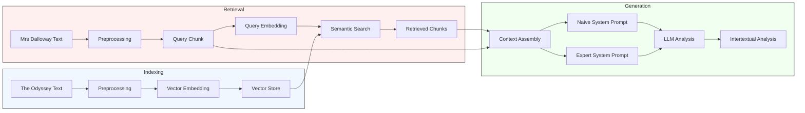

# Woolf Intertextuality Analysis

A pipeline for detecting and analyzing intertextual references between Virginia Woolf's "Mrs Dalloway" and Homer's "The Odyssey" using semantic search and large language models.

## Project Overview

This project implements a Retrieval Augmented Generation (RAG) pipeline to identify and analyze potential intertextual references between Virginia Woolf's "Mrs Dalloway" and Homer's "The Odyssey". It combines:

- Semantic search using embeddings to find similar passages
- Large Language Model analysis to evaluate intertextual relationships
- Structured output for a systematic analysis

## Experimental Design

The experiment follows these steps:

1. **Text Preprocessing**:
   - Chunks both texts into semantically meaningful segments
   - Preserves contextual information in chunk metadata (e.g. page number, chapter number - TBD might not be useful and removed later on)
   - Generate (OpenAI) embeddings for similarity search

2. **Similarity Detection**:
   - Uses semantic search to find potential intertextual connections
   - Scores passages based on embedding similarity
   - Filters results based on configurable thresholds

3. **Analysis**:
   - Implements a comparative prompt system to study the impact of expert knowledge:
     - **Naive Prompt**: Based purely on Kristeva's intertextuality theory
       * Provides baseline analysis without Woolf-specific knowledge
       * Focuses on fundamental intertextual relationships
       * Uses general literary analysis principles
       * Serves as control group for comparison

     - **Expert Prompt**: Enriched with Woolf's specific intertextual practices
       * Incorporates detailed knowledge of Woolf's techniques
       * Contains information about her Homeric transformation methods
       * Tests if expert knowledge improves detection and analysis

4. **Output Generation**:
   - Produces parallel analyses from both prompts for comparison
   - Enables evaluation of how expert knowledge affects:
     - Reference detection accuracy
     - Analysis depth and sophistication

     - Recognition of Woolf's subtle integration techniques
   - Facilitates systematic comparison through structured output

### Pipeline Architecture



## Installation

1. Clone the repository:

    ```bash
    git clone https://github.com/yourusername/woolf-intertextuality.git
    cd woolf-intertextuality
    ```

2. Install dependencies:

    ```bash
    # using pip
    pip install -r requirements.txt
    ```

    ```bash
    # using uv
    uv sync
    ```

3. Set up environment variables

    ```bash
    cp .env.example .env
    # Edit .env with your OpenAI API key
    ```

## Usage

The analysis can be run directly using `main.py`:

```bash
# Run analysis on all chunks
python -m src.main

# Limit analysis to first N chunks (for testing and money saving reasons)
python -m src.main --limit 5
```

The script will:

1. Load and preprocess both texts
2. Index The Odyssey chunks for similarity search
3. Process each Mrs Dalloway chunk to find similar passages
4. Perform intertextual analysis
5. Save results to a timestamped CSV file in `data/results/`

### Output

Results are saved as CSV files with the following information for each analyzed pair:

- Passage texts and metadata
- Similarity scores
- Intertextual reference analysis including:
  - Subtle integration patterns
  - Multiple operational levels (linguistic, structural, etc.)
  - Feminist transformations
  - Homeric elements
- Confidence levels
- Supporting textual evidence
- Detailed reasoning and counter-arguments

Example output path: `data/results/intertextual_analysis_20240315T143022.csv`

Example output:
|dalloway_text                                                                                                                                                                                                                                                                                                                                                                                                                                                                                                                                                                                                                                                                                                                                                                                                                                                                                                                                                                                                                                                                                                                                                                                                                                                                                                                                                                                                                                                                                                                                                                                                                                                                                                                                                                                                                   |odyssey_text                                                                                                                                                                                                                                                                                                                                                                                                                                                                                                                                                                                                                                                                                                                                                                                                                                                                                                                                                                                                                                                                                                                                                                                                                                                                                                                                                                                                                                                                                                                                                                                                                                                                                                                                                                                                                                                                                                                                                                                                                                                                                                                                                                                       |odyssey_chapter|similarity_score  |is_meaningful|confidence|initial_observation                                                                                                                                                                                                                                                                                                                                                                                               |surface_elements                                                                              |transformation|dialogic_aspects|meaning_transformation                                                                                                                                                                                                                                     |counter_arguments                                                                                                                                                                                                                                           |synthesis                                                                                                                                                                                                                                                                                                                                                                                                                                                                                         |supporting_evidence                                                                                                                                                                                                                                                                                                                              |
|--------------------------------------------------------------------------------------------------------------------------------------------------------------------------------------------------------------------------------------------------------------------------------------------------------------------------------------------------------------------------------------------------------------------------------------------------------------------------------------------------------------------------------------------------------------------------------------------------------------------------------------------------------------------------------------------------------------------------------------------------------------------------------------------------------------------------------------------------------------------------------------------------------------------------------------------------------------------------------------------------------------------------------------------------------------------------------------------------------------------------------------------------------------------------------------------------------------------------------------------------------------------------------------------------------------------------------------------------------------------------------------------------------------------------------------------------------------------------------------------------------------------------------------------------------------------------------------------------------------------------------------------------------------------------------------------------------------------------------------------------------------------------------------------------------------------------------|---------------------------------------------------------------------------------------------------------------------------------------------------------------------------------------------------------------------------------------------------------------------------------------------------------------------------------------------------------------------------------------------------------------------------------------------------------------------------------------------------------------------------------------------------------------------------------------------------------------------------------------------------------------------------------------------------------------------------------------------------------------------------------------------------------------------------------------------------------------------------------------------------------------------------------------------------------------------------------------------------------------------------------------------------------------------------------------------------------------------------------------------------------------------------------------------------------------------------------------------------------------------------------------------------------------------------------------------------------------------------------------------------------------------------------------------------------------------------------------------------------------------------------------------------------------------------------------------------------------------------------------------------------------------------------------------------------------------------------------------------------------------------------------------------------------------------------------------------------------------------------------------------------------------------------------------------------------------------------------------------------------------------------------------------------------------------------------------------------------------------------------------------------------------------------------------------|---------------|------------------|-------------|----------|------------------------------------------------------------------------------------------------------------------------------------------------------------------------------------------------------------------------------------------------------------------------------------------------------------------------------------------------------------------------------------------------------------------|----------------------------------------------------------------------------------------------|--------------|----------------|-----------------------------------------------------------------------------------------------------------------------------------------------------------------------------------------------------------------------------------------------------------|------------------------------------------------------------------------------------------------------------------------------------------------------------------------------------------------------------------------------------------------------------|--------------------------------------------------------------------------------------------------------------------------------------------------------------------------------------------------------------------------------------------------------------------------------------------------------------------------------------------------------------------------------------------------------------------------------------------------------------------------------------------------|-------------------------------------------------------------------------------------------------------------------------------------------------------------------------------------------------------------------------------------------------------------------------------------------------------------------------------------------------|
|Mrs. Dalloway said she would buy the flowers herself. For Lucy had her work cut out for her. The doors would be taken off their hinges; Rumpelmayer's men were coming…                                                                                                                                                                                                                                                                                                                                                                                                                                                                                                                                                                                                                                                                                                                                                                                                                                                                                                                                                                                                                                                                                                                                                                                                                                                                                                                                                                                                                                                                                                                                                                                                                                                          | If the lordly wooers shall slay me by guile in the halls, and divide among them the heritage of my father, then I should wish thee to keep and enjoy the gifts thyself, rather than any of these. But..                                                                                                                                                                                                                                                                                                                                                                                                                                                                                                                                                                                                                                                                                                                                                                                                                                                                                                                                                                                                                                                                                                                                                                                                                                                                                                                                                                                                                                                                                                                                                                                                                                                                                                                                                                                                                                                                                                                                                                                           |BOOK XVII.     |0.7257353488123867|True         |medium    |The Mrs. Dalloway passage opens with Clarissa's intention to buy flowers herself, which sets a tone of independence and personal agency. The passage is rich with sensory imagery, particularly the fresh morning air and the metaphor of a wave, which evokes a sense of renewal and anticipation. The Odyssey passage, on the other hand, involves themes of hospitality, domesticity, and the emotional weight of absence, as seen in Penelope's lament for Odysseus. Both passages involve domestic settings and the presence of a female character reflecting on their circumstances.|domestic setting;female protagonist;reflection on past                                        |thematic      |thematic        |In Mrs. Dalloway, the domestic setting and female protagonist reflect a modernist exploration of inner consciousness and societal roles, whereas in The Odyssey, these elements are part of an epic narrative focused on loyalty and longing. The transformation highlights the shift from epic heroism to personal introspection.|The connection between the passages might be coincidental, as both deal with universal themes of domesticity and reflection.;The stylistic and thematic differences between modernist and epic literature could overshadow any intertextual relationship.   |The Mrs. Dalloway passage can be seen as an intertextual reference to The Odyssey through its thematic parallels of domesticity and reflection. Woolf transforms these elements into a modernist exploration of personal consciousness and societal roles, contrasting with the epic's focus on heroism and loyalty. The intertextual connection is subtle and operates on a thematic level, reflecting Woolf's distinctive practice of integrating classical material into her work.             |Clarissa's reflection on the morning air and anticipation mirrors the hope and renewal found in The Odyssey.;The domestic setting and focus on a female character's inner life parallel Penelope's domestic role and emotional reflection.                                                                                                       |
|Mrs. Dalloway said she would buy the flowers herself. For Lucy had her work cut out for her. The doors would be taken off their hinges; Rumpelmayer's men were coming…                                                                                                                                                                                                                                                                                                                                                                                                                                                                                                                                                                                                                                                                                                                                                                                                                                                                                                                                                                                                                                                                                                                                                                                                                                                                                                                                                                                                                                                                                                                                                                                                                                                          | Anon came the throned Dawn, and awakened Nausicaa of the fair robes, who straightway marvelled on the dream, and went through the halls to tell her parents, her father dear and her mother. And she found them within, her mother sitting …                                                                                                                                                                                                                                                                                                                                                                                                                                                                                                                                                                                                                                                                                                                                                                                                                                                                                                                                                                                                                                                                                                                                                                                                                                                                                                                                                                                                                                                                                                                                                                                                                                                                                                                                                                                                                                                                                                                                                      |BOOK VI.       |0.7220677384820512|True         |high      |Both passages involve female characters engaging in domestic activities that are imbued with a sense of ritual and significance. Clarissa Dalloway's preparation for a party and Nausicaa's preparation for washing clothes both involve a sense of anticipation and a connection to their respective environments.                                                                                               |domestic preparation;anticipation;connection to environment                                   |thematic      |thematic        |In Mrs. Dalloway, the domestic preparation is transformed into a moment of introspection and reflection on past experiences, while in The Odyssey, it is a prelude to a significant encounter. The domestic sphere in Woolf's text gains an epic-like significance, mirroring the importance of Nausicaa's actions in the epic.|The connection might be coincidental as both texts simply depict common domestic activities.;The thematic resonance might not be intentional but rather a result of similar narrative needs.                                                                |The passage from Mrs. Dalloway can be seen as an intertextual reference to The Odyssey through its thematic and structural parallels. Woolf transforms the domestic preparation into a moment of introspection and societal observation, elevating the domestic sphere to an epic-like significance, similar to Nausicaa's role in The Odyssey. This transformation aligns with Woolf's feminist reinterpretation of classical themes, where domestic actions are given epic importance.          |Clarissa's morning routine and anticipation mirror Nausicaa's preparation for washing clothes.;Both passages emphasize the significance of domestic activities and their connection to the environment.;Woolf's narrative style elevates the domestic sphere to an epic-like significance, similar to Nausicaa's role in The Odyssey.            |

## Configuration

Key settings can be configured in `src/config/settings.py` or via environment variables (see `.env.example`):

- LLM parameters (model, temperature, max tokens)
- Embedding settings
- Preprocessing parameters (chunk size, overlap)
- File paths and storage locations

