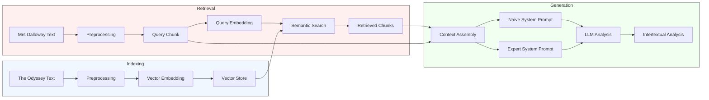

# Woolf Intertextuality Analysis

A pipeline for detecting and analyzing intertextual references between Virginia Woolf's "Mrs Dalloway" and Homer's "The Odyssey" using semantic search and large language models.

## Project Overview

This project implements a Retrieval Augmented Generation (RAG) pipeline to identify and analyze potential intertextual references between Virginia Woolf's "Mrs Dalloway" and Homer's "The Odyssey". It combines:

- Semantic search using embeddings to find similar passages
- Large Language Model analysis to evaluate intertextual relationships
- Structured output for a systematic analysis

## Experimental Design

The experiment follows these steps:

1. **Text Preprocessing**:
   - Chunks both texts into semantically meaningful segments
   - Preserves contextual information in chunk metadata (e.g. page number, chapter number - TBD might not be useful and removed later on)
   - Generate (OpenAI) embeddings for similarity search

2. **Similarity Detection**:
   - Uses semantic search to find potential intertextual connections
   - For each Dalloway passage:
     * Finds top-k most similar Odyssey passages
     * Finds top-k most dissimilar Odyssey passages for contrast
   - Scores passages based on embedding similarity
   - Filters results based on configurable thresholds

3. **Analysis**:
   - Analyzes both similar and dissimilar passage pairs
   - Considers similarity type in the analysis
   - Generates structured analysis with:
     * Initial observations
     * Analytical steps with evidence
     * Counter-arguments
     * Synthesis
     * Textual intersections

4. **Output Generation**:
   - Produces parallel analyses from both prompts for comparison
   - Enables evaluation of how expert knowledge affects:
     - Reference detection accuracy
     - Analysis depth and sophistication

     - Recognition of Woolf's subtle integration techniques
   - Facilitates systematic comparison through structured output

### Pipeline Architecture



## Installation

1. Clone the repository:

    ```bash
    git clone https://github.com/yourusername/woolf-intertextuality.git
    cd woolf-intertextuality
    ```

2. Install dependencies:

    ```bash
    # using pip
    pip install -r requirements.txt
    ```

    ```bash
    # using uv
    uv sync
    ```

3. Set up environment variables

    ```bash
    cp .env.example .env
    # Edit .env with your OpenAI API key
    ```

## Usage

The analysis can be run directly using `main.py`:

```bash
# Run analysis on all chunks
python -m src.main

# Limit analysis to first N chunks (for testing and money saving reasons)
python -m src.main --limit 5
```

The script will:

1. Load and preprocess both texts
2. Index The Odyssey chunks for similarity search
3. Process each Mrs Dalloway chunk to find similar passages
4. Perform intertextual analysis
5. Save results to a timestamped CSV file in `data/results/`

### Output

Results are saved as CSV files with the following information for each analyzed pair:

- Passage texts and metadata
- Similarity scores
- Intertextual reference analysis including:
  - Subtle integration patterns
  - Multiple operational levels (linguistic, structural, etc.)
  - Feminist transformations
  - Homeric elements
- Confidence levels
- Supporting textual evidence
- Detailed reasoning and counter-arguments

Example output path: `data/results/intertextual_analysis_20240315T143022.csv`

Example output:

**To be added**

## Configuration

Key settings can be configured in `src/config/settings.py` or via environment variables (see `.env.example`):

- LLM parameters (model, temperature, max tokens)
- Embedding settings
- Preprocessing parameters (chunk size, overlap)
- File paths and storage locations

### Evaluation Output

The system generates two types of output files:

1. **Analysis Results** (`data/results/`):
   - Raw analysis output from both Naive and Expert prompts
   - Includes similarity scores, textual comparisons, and detailed analyses
   - Format: `intertextual_analysis_{prompt_type}_{model}_{timestamp}.csv`

2. **Annotation Files** (`data/evaluation/`):
   - Anonymized outputs for blind classification
   - Answer key mapping analysis IDs to prompt types
   - Format: 
     - `annotation_ready_{analysis_file}.csv`
     - `answer_key_{analysis_file}.csv`

The annotation CSV facilitates:
- Blind classification of outputs as Naive/Expert
- Documentation of thematic and surface-level observations
- Collection of annotator justifications
- Tracking of inter-annotator agreement

## Development

### Testing

Tests are written using pytest and can be run with:

```bash
# Run all tests
uv run pytest

# Run with coverage report
uv run pytest --cov=src tests/

# Run specific test file
uv run pytest tests/test_pipeline_steps.py

# Run specific test
uv run pytest tests/test_pipeline_steps.py::test_analysis_step
```

The test suite includes:
- Unit tests for all pipeline components
- Integration tests for the full analysis pipeline
- Mock OpenAI responses to avoid API calls during testing

### Code Quality

This project uses Ruff for linting and formatting. Ruff combines the functionality of multiple Python linters (like flake8, black, isort) into a single fast tool.

#### Installing Ruff

```bash
# Install Ruff as a development tool
uv tool install ruff

# Or upgrade to latest version
uv tool upgrade ruff
```

```bash
# Run linter
uv run ruff check .

# Auto-fix linting issues
uv run ruff check --fix .

# Format code
uv run ruff format .
```

Ruff is configured in `pyproject.toml` with the following settings:
- Line length: 88 characters (same as Black)
- Python target version: 3.9+
- Enabled rules:
  - E4, E7, E9: Essential error checks
  - F: PyFlakes error detection

### Continuous Integration

GitHub Actions automatically run tests and linting on all pull requests and pushes to main. The workflow:
1. Runs the full test suite
2. Generates a coverage report
3. Checks code formatting with Ruff
4. Ensures all tests pass before merging

To run all checks locally before committing:
```bash
# Sync project dependencies including dev dependencies
uv sync --all-extras --dev

# Run all checks
uv run pytest && uv run ruff check . && uv run ruff format --check .
```

### Project Structure

The project follows standard Python project structure:
```
.
├── .venv                  # Virtual environment (created by uv)
├── .python-version        # Python version specification
├── pyproject.toml         # Project metadata and dependencies
├── uv.lock               # Lockfile for reproducible installations
├── src/                  # Source code
├── tests/                # Test files
└── data/                 # Data files
```

For more details on project structure and management with uv, see the [uv documentation](https://docs.astral.sh/uv/).

