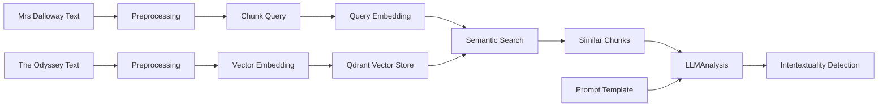

# Woolf Intertextuality Analysis

A pipeline for detecting and analyzing intertextual references between Virginia Woolf's "Mrs Dalloway" and Homer's "The Odyssey" using semantic search and large language models.

## Project Overview

This project implements a Retrieval Augmented Generation (RAG) pipeline to identify and analyze potential intertextual references between Virginia Woolf's "Mrs Dalloway" and Homer's "The Odyssey". It combines:

- Semantic search using embeddings to find similar passages
- Large Language Model analysis to evaluate intertextual relationships
- Structured output for a systematic analysis

## Experimental Design

The experiment follows these steps:

1. **Text Preprocessing**:
   - Chunks both texts into semantically meaningful segments
   - Preserves contextual information in chunk metadata (e.g. page number, chapter number - TBD might not be useful and removed later on)
   - Generate (OpenAI) embeddings for similarity search

2. **Similarity Detection**:
   - Uses semantic search to find potential intertextual connections
   - Scores passages based on embedding similarity
   - Filters results based on configurable thresholds

3. **Analysis**:
   - Applies structured prompts for consistent analysis
   - Considers multiple aspects of intertextual relationships
   - Generates detailed explanations

4. **Output Generation**:
   - Produces structured analysis results
   - Includes confidence levels and supporting evidence
   - Enables systematic evaluation of findings

### Pipeline Architecture



## Installation

1. Clone the repository:

    ```bash
    git clone https://github.com/yourusername/woolf-intertextuality.git
    cd woolf-intertextuality
    ```

2. Install dependencies:

    ```bash
    # using pip
    pip install -r requirements.txt
    ```

    ```bash
    # using uv
    uv sync
    ```

3. Set up environment variables

    ```bash
    cp .env.example .env
    # Edit .env with your OpenAI API key
    ```

## Usage

The analysis can be run directly using `main.py`:

```bash
# Run analysis on all chunks
python -m src.main

# Limit analysis to first N chunks (for testing and money saving reasons)
python -m src.main --limit 5
```

The script will:

1. Load and preprocess both texts
2. Index The Odyssey chunks for similarity search
3. Process each Mrs Dalloway chunk to find similar passages
4. Perform intertextual analysis
5. Save results to a timestamped CSV file in `data/results/`

### Output

Results are saved as CSV files with the following information for each analyzed pair:

- Passage texts and metadata
- Similarity scores
- Intertextual reference details
- Analysis reasoning and evidence
- Confidence levels
- Supporting textual codes

Example output path: `data/results/intertextual_analysis_20240315T143022.csv`

Example output:

|dalloway_text                                                                                                                                                                     |odyssey_text                                                                                                                                                                                                                                 |odyssey_chapter|similarity_score  |is_reference|reference_type   |confidence|textual_codes                                                                     |explanation                                                                                                                                                                                                                                                                                                                                          |transformation                                                                                                                                                                                                                                                                                 |supporting_evidence                                                                                                                                                                                                                                                    |initial_observation                                                                                                                                                                                                                                                                                                                                                                                                                      |contextual_analysis                                                                                                                                                                                                                                                                                                                                                                                                                                                                              |code_identification                                                               |dialogic_analysis                                                                                                                                                                                                                                                                                                                                                                                                                                                                                              |transformation_analysis                                                                                                                                                                                                                                                                                                                                                                                                                                            |counter_arguments                                                                                                                                                                                                                                                                       |synthesis                                                                                                                                                                                                                                                                                                                                                                                                                                   |
|----------------------------------------------------------------------------------------------------------------------------------------------------------------------------------|---------------------------------------------------------------------------------------------------------------------------------------------------------------------------------------------------------------------------------------------|---------------|------------------|------------|-----------------|----------|----------------------------------------------------------------------------------|-----------------------------------------------------------------------------------------------------------------------------------------------------------------------------------------------------------------------------------------------------------------------------------------------------------------------------------------------------|-----------------------------------------------------------------------------------------------------------------------------------------------------------------------------------------------------------------------------------------------------------------------------------------------|-----------------------------------------------------------------------------------------------------------------------------------------------------------------------------------------------------------------------------------------------------------------------|-----------------------------------------------------------------------------------------------------------------------------------------------------------------------------------------------------------------------------------------------------------------------------------------------------------------------------------------------------------------------------------------------------------------------------------------|-------------------------------------------------------------------------------------------------------------------------------------------------------------------------------------------------------------------------------------------------------------------------------------------------------------------------------------------------------------------------------------------------------------------------------------------------------------------------------------------------|----------------------------------------------------------------------------------|---------------------------------------------------------------------------------------------------------------------------------------------------------------------------------------------------------------------------------------------------------------------------------------------------------------------------------------------------------------------------------------------------------------------------------------------------------------------------------------------------------------|-------------------------------------------------------------------------------------------------------------------------------------------------------------------------------------------------------------------------------------------------------------------------------------------------------------------------------------------------------------------------------------------------------------------------------------------------------------------|----------------------------------------------------------------------------------------------------------------------------------------------------------------------------------------------------------------------------------------------------------------------------------------|--------------------------------------------------------------------------------------------------------------------------------------------------------------------------------------------------------------------------------------------------------------------------------------------------------------------------------------------------------------------------------------------------------------------------------------------|
|Mrs. Dalloway said she would buy the flowers herself. For Lucy had her work cut out for her. The doors would be taken off their hinges; Rumpelmayer's men were coming. And then, …| If the lordly wooers shall slay me by guile in the halls, and divide among them the heritage of my father, then I should wish thee to keep and enjoy the gifts thyself, rather than any of these. But if I shall sow …                      |BOOK XVII.     |0.7257353488123867|True        |thematic parallel|medium    |Anticipation of future,Domestic setting,Emotional introspection,Reflection on past|The passages share thematic parallels in their exploration of reflection and anticipation, with Woolf's text offering a modernist and feminist reinterpretation of these themes. The semantic similarities suggest an intertextual dialogue, with Woolf transforming classical elements into a critique of societal roles and expectations for women.|Woolf transforms the classical theme of waiting and loyalty, as seen in Penelope's character, into a modernist exploration of a woman's internal life and societal roles, emphasizing agency and introspection.                                                                                |Clarissa's reflection on past events and anticipation of the day's events parallels Penelope's reflection and anticipation of Odysseus's return.;Both passages involve domestic settings and emotional introspection, highlighting the roles and expectations of women.|Both passages explore themes of anticipation and reflection on past experiences. In 'Mrs Dalloway,' Clarissa reflects on her past with a sense of nostalgia and anticipation for the day's events, while in 'The Odyssey,' Penelope reflects on her past sorrows and anticipates the potential return of Odysseus. Both passages involve a sense of waiting and the passage of time, though expressed through different narrative lenses.|In 'Mrs Dalloway,' the passage sets the stage for Clarissa's day, filled with preparations and reflections on her past, highlighting her internal world and the social dynamics around her. In 'The Odyssey,' the passage focuses on Penelope's enduring patience and sorrow, emphasizing themes of loyalty and the domestic sphere. Both passages serve to deepen the reader's understanding of the characters' emotional states and their roles within their respective narratives.            |Reflection on past,Anticipation of future,Domestic setting,Emotional introspection|The texts engage in a dialogue about the roles of women in society and their emotional landscapes. Woolf's modernist approach allows for a deeper exploration of Clarissa's internal thoughts and societal roles, while Homer's epic focuses on Penelope's loyalty and endurance. Woolf's text can be seen as a feminist reinterpretation, giving voice to the internal struggles and societal expectations of women, paralleling Penelope's silent endurance with Clarissa's active engagement with her world.|Woolf transforms the classical theme of waiting and loyalty, embodied by Penelope, into a modernist exploration of a woman's internal life and societal roles. Clarissa's reflections and actions are imbued with a sense of agency and introspection, contrasting with Penelope's more passive endurance. This transformation highlights Woolf's feminist perspective, subverting the traditional narrative by focusing on the complexity of a woman's inner life.|The thematic similarities might be coincidental, reflecting broader literary themes of reflection and anticipation.,Woolf's modernist style and focus on internal monologue might not directly reference Homer but rather reflect a general literary evolution.                         |The passages reflect a meaningful intertextual dialogue, with Woolf's 'Mrs Dalloway' transforming classical themes from 'The Odyssey' into a modernist exploration of a woman's internal and social world. The semantic similarities suggest a broader cultural engagement with themes of reflection, anticipation, and the roles of women, with Woolf's text offering a critical and feminist reinterpretation of these classical elements.|
|Mrs. Dalloway said she would buy the flowers herself. For Lucy had her work cut out for her. The doors would be taken off their hinges; Rumpelmayer's men were coming. And then, …| Anon came the throned Dawn, and awakened Nausicaa of the fair robes, who straightway marvelled on the dream, and went through the halls to tell her parents, her father dear and her mother. And she found them within, her mother sitting …|BOOK VI.       |0.7220677384820512|True        |thematic parallel|medium    |Domestic imagery,Female agency,Morning freshness,Social roles                     |The passages share thematic parallels in their depiction of female characters engaging in domestic tasks with a sense of agency and anticipation. Woolf's modernist approach transforms the classical theme by emphasizing personal autonomy and subverting traditional gender roles.                                                                |Woolf transforms the classical motif of female domesticity by highlighting Clarissa's autonomy and personal choice, contrasting with Nausicaa's actions, which are framed within familial and societal expectations. This reflects Woolf's feminist reinterpretation of traditional narratives.|Clarissa's decision to buy flowers herself reflects personal agency, similar to Nausicaa's initiative in preparing for washing clothes.;Both passages use morning imagery to evoke a sense of freshness and new beginnings.                                            |Both passages involve female characters engaging in domestic activities that are imbued with a sense of personal agency and anticipation. Clarissa Dalloway's decision to buy flowers herself and Nausicaa's preparation for washing clothes both reflect a moment of personal initiative. The imagery of freshness and the morning in both passages suggests a thematic parallel of new beginnings or renewal.                          |In 'Mrs Dalloway,' the passage sets the stage for Clarissa's day, highlighting her independence and the social expectations she navigates. The reference to flowers and the morning air evokes a sense of renewal and anticipation. In 'The Odyssey,' Nausicaa's actions are part of a larger narrative of hospitality and preparation for Odysseus's arrival, emphasizing her role within her family and society. Both passages use domestic tasks to explore themes of agency and social roles.|Domestic imagery,Morning freshness,Female agency,Social roles                     |Woolf's passage engages in a dialogue with Homer by transforming the classical theme of female domesticity into a modernist exploration of personal agency and social identity. While Nausicaa's actions are framed within her duties to her family and society, Clarissa's decision to buy flowers herself reflects a more individualistic assertion of agency, subverting traditional gender roles.                                                                                                          |Woolf transforms the classical motif of female domesticity by emphasizing Clarissa's autonomy and the personal significance of her actions. Unlike Nausicaa, whose actions are tied to familial and societal expectations, Clarissa's decision is portrayed as a personal choice, reflecting Woolf's feminist reinterpretation of traditional narratives.                                                                                                          |The similarities in domestic imagery and morning freshness could be coincidental, reflecting common literary motifs rather than intentional reference.,The thematic focus on female agency might be a broader modernist concern rather than a specific intertextual dialogue with Homer.|The passages reflect a meaningful intertextual dialogue where Woolf reinterprets and transforms classical themes of female domesticity and agency. By emphasizing Clarissa's autonomy, Woolf critiques and subverts traditional gender roles, offering a modernist perspective that challenges the male-dominated narratives of classical texts.                                                                                            |

## Configuration

Key settings can be configured in `src/config/settings.py` or via environment variables (see `.env.example`):

- LLM parameters (model, temperature, max tokens)
- Embedding settings
- Preprocessing parameters (chunk size, overlap)
- File paths and storage locations
