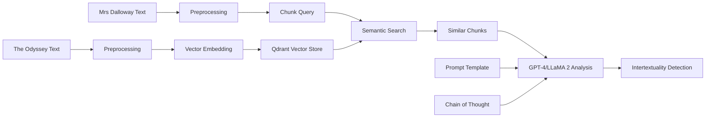

# Detecting Intertextuality between Virginia Woolf's "Mrs Dalloway" and Homer's "The Odyssey" Using AI Techniques

## Abstract

[Brief summary of the research, methodology, and key findings]

## 1. Introduction

- Background on intertextuality in literature
- Brief overview of "Mrs Dalloway" and "The Odyssey"
- Importance of computational approaches in literary analysis
- Research question and objectives

## 2. Literature Review

### 2.1 Intertextuality in Literary Theory

Intertextuality, a concept introduced by Julia Kristeva in the late 1960s, has become a fundamental principle in literary theory and criticism. It posits that the meaning of a text is shaped by its relationships with other texts. Kristeva's formulation suggests that any text is an "intertext" - a site where numerous texts intersect and interact[^1].

<!-- Talk about how the concept of intertextuality challenges the traditional notion of texts as self-contained, autonomous entities. Instead, it presents texts as part of a complex network of cultural discourses, where meaning is created through the interplay of various textual elements. It is nothing new, but Kristeva's work is the first time it was coined. -->
> The concept of intertextuality challenges the traditional notion of texts as self-contained, autonomous entities. Instead, it presents texts as part of a complex network of cultural discourses, where meaning is created through the interplay of various textual elements.

This view aligns with Roland Barthes' idea of the text as "a tissue of quotations" drawn from innumerable centers of culture[^1]. Intertextuality has profound implications for literary analysis, as it encourages readers and critics to consider texts not in isolation, but as part of a broader cultural and literary context. This approach has been particularly influential in:

- Poststructuralist theory
- Feminist literary criticism
- Postcolonial studies

### 2.2 Computational Literary Studies

The field of computational literary studies has emerged as a significant area of research, applying computational methods to the analysis of literary texts. This interdisciplinary approach combines techniques from:

1. Natural Language Processing (NLP)
2. Machine Learning
3. Digital Humanities

These techniques are used to explore literary works at scale. Nils Reiter has been at the forefront of this field, particularly in the analysis of dramatic texts. His work on the QuaDramA project demonstrates how NLP methods can be used to investigate:

- Character development
- Relationships between characters
- Other dramatic elements across large datasets

This approach allows for testing hypotheses about literary characters and structures on a scale that would be impractical through traditional close reading methods[^2].

Ketzan and Werner's study on language identification in literary texts highlights both the potential and challenges of applying NLP to literature. Their evaluation of various language identification tools on English literary texts containing snippets of French and Spanish underscores the complexities involved in analyzing multilingual aspects of literature using computational methods[^3].

### 2.3 Intertextuality in Virginia Woolf's Work

The concept of intertextuality is particularly relevant to Virginia Woolf's writing, especially in "Mrs. Dalloway". Scholars have extensively explored the rich tapestry of intertextual references in Woolf's novel, revealing its deep connections to classical literature and mythology.

#### Molly Hoff's Analysis

Molly Hoff's work, particularly her article "The Pseudo-Homeric World of Mrs. Dalloway", provides a comprehensive analysis of the intertextual relationships between Woolf's novel and classical Greek texts. Hoff argues that Woolf "paraphrases, parodies, and burlesques" a number of Greek texts, particularly Homer's "Odyssey"[^3]. She identifies numerous allusions and parallels between characters and events in "Mrs. Dalloway" and "The Odyssey", demonstrating how Woolf's use of intertextuality enriches the novel's themes and characterizations[^1].

#### Anne E. Fernald's Perspective

Anne E. Fernald's work on Woolf and intertextuality offers another valuable perspective. Fernald discusses Woolf's engagement with the literary tradition, particularly Homer and Greek literature, highlighting how Woolf's feminist perspective leads her to rewrite and subvert male-dominated narratives[^1]. This approach demonstrates how intertextuality can be a tool for critical engagement with literary traditions.

#### Extended Intertextual Connections

The intertextual nature of "Mrs. Dalloway" extends beyond classical references:

- As William Patrick Wend notes, the novel's working title, "The Hours", suggests connections to Homer's "Odyssey" through its etymological roots[^4].
- Characters in the novel often parallel figures from Greek mythology and epic poetry, creating a complex web of intertextual relationships[^4].

By examining these scholarly perspectives, we can see how intertextuality in "Mrs. Dalloway" operates on multiple levels, from explicit references to subtle allusions, creating a rich, multi-layered text that engages deeply with literary tradition while simultaneously critiquing and reimagining it.

### 2.4 Large Language Models and Computational Literary Studies

The advent of large language models (LLMs) has opened up new possibilities for computational literary studies. These models, trained on vast amounts of textual data, have demonstrated impressive capabilities in understanding and generating human-like text.

#### Recent Developments

Recent research has shown that LLMs can be effectively leveraged for tasks relevant to literary analysis. For instance, Karpinska and Iyyer's study on using GPT-3.5 for literary translation demonstrates that LLMs can effectively handle document-level context, resulting in higher-quality translations compared to sentence-level approaches[^5].

#### Opportunities for Intertextual Analysis

The improved capabilities of LLMs offer new opportunities for intertextual analysis:

- Ability to process and understand large amounts of text
- Contextual awareness
- Potential for detecting and analyzing intertextual relationships

This is particularly relevant for studies like ours, which aims to explore intertextuality between Virginia Woolf's "Mrs Dalloway" and Homer's "The Odyssey".

#### Challenges and Considerations

However, it's important to note that while LLMs show promise, they also present challenges:

- Issues of bias
- Interpretability
- Need for domain-specific fine-tuning

These are areas of ongoing research and debate in the field.

By combining the theoretical framework of intertextuality with the computational power of LLMs and the methodological insights from computational literary studies, we aim to develop a novel approach to analyzing intertextual relationships in literature.

## 3. Methodology

Retrieval augmented generation (RAG) is a technique that combines the strengths of large language models (LLMs) with external knowledge sources to generate more accurate and relevant responses. In the context of intertextuality, RAG can be used to search for and retrieve relevant textual evidence from a large corpus of literary works, which can then be used to support the generation of new insights and interpretations. RAG can be used to tackle the existing challenges of LLMs, such as hallucinations, biases and interpretability.

### 3.1 Data Selection and Preparation

- Selection of texts:
  - "Mrs Dalloway" by Virginia Woolf
  - "The Odyssey" translation (specify which translation and justify choice)
- Preprocessing of texts
- Chunking strategies and contextual headers

### 3.2 Semantic Similarity Search

- Advanced embedding techniques (e.g., BERT, GPT)
- Improved chunking strategies
- Vector database implementation (e.g., Qdrant, FAISS)
- Similarity threshold determination

Another typical approach is hybrid search, which combines semantic search with keyword search. But as intertextuality is not always explicit, semantic search is more appropriate in this experiment.

### 3.3 LLM-based Analysis

The LLM-based analysis is the core part of this experiment. It is used to detect intertextuality by comparing the chunks with the input query. The prompt template and chain of thought are also important for the accuracy of the results. We make use of the structured output technique from the openai api.

- Choosing the right Prompt
- Chain of Thought

### 3.4 Comparison with Known Intertextual References

- Creation of a scholarly reference database
- Matching system for AI-detected similarities and known references
- Categorization of reference types, such as[^2]:
  - Character parallels (e.g., Peter Walsh as Odysseus, Daisy as Penelope)
  - Thematic echoes (e.g., the concept of return and rebirth)
  - Structural similarities (e.g., use of flashbacks, in medias res narrative)
- Evaluation metrics (precision, recall, F1-score)

### 3.4 Deep Analysis of Potential New Intertextual Connections

- Identification of novel connections
- LLM-based analysis (e.g., GPT-4, LLaMA 2)
- Multi-aspect consideration (themes, characters, structure, style)
- Expert validation system
- Iterative refinement process

### 3.5 Evaluation Metrics

- Criteria for assessing intertextual references
- Quantitative and qualitative evaluation methods

## 4. Results

- Quantitative analysis of semantic similarities
- Comparison of AI-detected connections with scholarly references
- Analysis of potentially new intertextual connections, such as:
  - Temporal structures in both works[^2]
  - Use of disguise and revelation[^2]
  - Parallels in character roles and functions
- Expert validation outcomes

## 5. Discussion

- Interpretation of results from the three-step approach
- Strengths and limitations of the methodology
- Implications for computational literary analysis
- Ethical considerations in AI-assisted literary research
- Reflection on how findings relate to Hoff and Fernald's insights
- Discussion of how the AI system captures Woolf's use of intertextuality as a means of feminist commentary[^4]

## 6. Conclusion

- Summary of key findings
- Contributions to the field
- Future research directions (including potential use of GraphRAG)

## References

[List of cited works, including the search results provided]

## Appendices

- **Appendix A**: Detailed preprocessing steps
- **Appendix B**: Prompt templates for LLM analysis
- **Appendix C**: Sample outputs from semantic similarity search
- **Appendix D**: Comparison table of AI-detected vs. known scholarly references
- **Appendix E**: Expert validation form and results

[^1]: Julia Kristeva: Intertextuality - Literary Theory and Criticism. (2016). Literariness.org.
[^2]: Reiter, N., & Schulz, S. (2018). Computational Linguistics Meets Digital Humanities. University of Stuttgart.
[^3]: Ketzan, E., & Werner, N. (2022). 'Entrez!' she called: Evaluating Language Identification Tools in English Literary Texts. In CHR 2022: Computational Humanities Research Conference.
[^4]: Reference to Molly Hoff's article
[^5]: Karpinska, M., & Iyyer, M. (2023). Large Language Models Effectively Leverage Document-level Context for Literary Translation, but Critical Errors Persist. In Proceedings of the Eighth Conference on Machine Translation, pages 419–451, Singapore. Association for Computational Linguistics.
